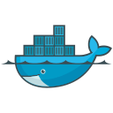

<h1 align="left" id="macropower-title">:wave: Hi , नमस्ते, سلام..! </h1>
<h1 align="left" id="macropower-title">I'm Fardeen Ahmed</h1>
<h3 align="left">A N3rd doing his job, making things look more cooler and. accessible</h3>



</a>

- I create blogs & writeups of Security Development, Security research and Information Security  
- I create digital content, consumed by pretty good number of people on social media  
- I contribute over Github, for sure  
- I read books (Favorite till now : The Alamanack of Naval Ravikant) 
- I love treks, long walks and relative long journey rides 

<h2 align="left" id="macropower-tech">Favorite Tech</h2>

- Tools, languages, and other things that I like to work with  

<table>
<tr>
<td align="center" width="96">

 Python
</td>
<td align="center" width="96">

 Go
</td>
<td align="center" width="96">

 Java
</td>
<td align="center" width="96">

 Jasypt
</td>
<td align="center" width="96">

 JavaScript
</td>
<td align="center" width="96">

 React
</td>
<td align="center" width="96">

 Ansible
</td>
<td align="center" width="96">

 Jenkins
</td>
<td align="center" width="96">

 Bootstrap
</td>
<tr>
<td align="center" width="96"> 

 Docker
</td>
<td align="center" width="96">

 Insomnia
</td>
<td align="center" width="96">

 Kubernetes
</td>
<td align="center" width="96">

 Debian
</td>
<td align="center" width="96">

 RHEL
</td>
<td align="center" width="96">

 Powershell
</td>
<td align="center" width="96">

 MySQL
</td>
</a>
</td>
</tr>
</table>
